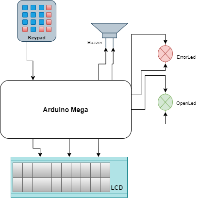

# SmartLock-arduino

This project represents a locking sistem, it uses bluetooth to send a password to the owner's device and waits for said password to be introduced on the keybad, if the password is not introduced in one minute it will reset. In the case that the password is wrongly introduced 3 times an alarm will sound of 

## Diagram

## Requirements

The project will
* Generate and send throught bluetooth a password when * is pressed on the keypad
* Wait for the input and test the input from the keypad
* Announce when the password is wrong or correct
* Sound an alarm when the password what wrong 3 times
* Display the time throughout it's activity

## Specifications
  Hardware:
  * An Arduino Mega Booard
  * A breadboard
  * A data cable
  * A keypad
  * 2 LEDs
  * A buzzer
  * LCD shield
  
  Software:
  * Arduino IDE
  * LCD library
  * Time library
  * Keypad library
  
## User Manual
* You need to download the project from Github
* Open it in a Arduino IDE
* Verify and Upload on a compatible board
* Connect to the bluetooth device
* Download Serial Bluetooth Terminal
* On the app select the Bluetooth device and you'll have acces to the serial terminal
* Press * in order for the program to start and send the password

## Explanations
  *For this project to meet your needs you can connect the openPin to anything you wish to lock, once the password is verified it will unlock for 5 seconds (can be changed but I decide to only have it for a short amount of time for better testing)
  
  ### Bibliografy
* [How to use bluetooth](http://users.utcluj.ro/~rdanescu/pmp-lab8-Bluetooth-RO.pdf)
* [Laboratory guide](https://biblioteca.utcluj.ro/files/carti-online-cu-coperta/336-3.pdf) - page 24 for the LCD
* [Keypad tutorial](http://www.circuitbasics.com/how-to-set-up-a-keypad-on-an-arduino/)
